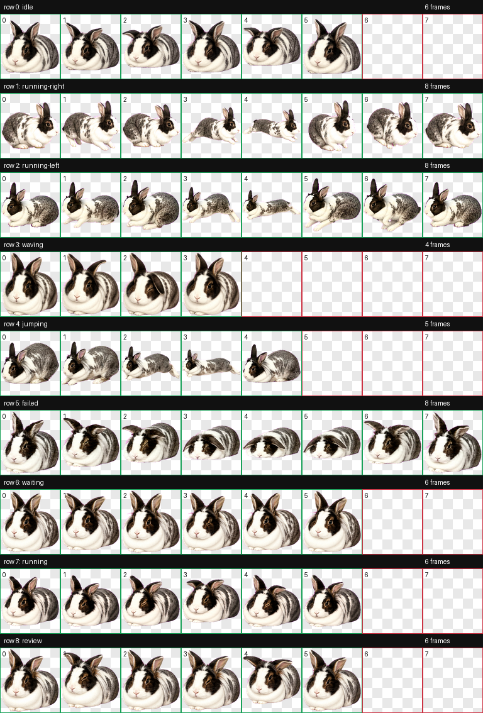
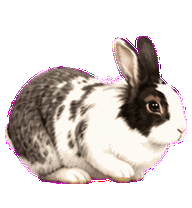
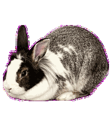

# Luna Codex Pet

Luna is a custom animated Codex pet based on Josh's real rabbit: a long, low white-and-gray lionhead-mix rabbit with a low dewlap-cushioned head, compact steep tucked loaf, long hind feet that kick through motion, mottled gray saddle patches, a white blaze, dark eye mask, quirky left eye, and expressive ears.



## What Makes Luna Special

- Full Codex pet atlas: `1536x1872`, 8 columns by 9 rows, `192x208` cells.
- Nine states: idle, running-right, running-left, waving, jumping, failed, waiting, running, and review.
- Rabbit-specific animation rules: forefeet reach/land, hindquarters load, long hind feet kick through toe-off, flight, and recovery.
- Accurate loaf anatomy: low head on dewlap, tucked front feet, compact steep gray haunch when hind legs are folded.
- No generic paw/arm shapes: feet stay rabbit-specific and only appear where motion requires them.
- Public-safe package: generated pet assets and docs only. Original private reference photos are not included.

## Preview

Open [`index.html`](index.html) locally, or use GitHub Pages once enabled for this repo.

Per-state GIF previews are in [`assets/previews`](assets/previews):

| State | Preview |
| --- | --- |
| idle |  |
| running-right |  |
| running-left |  |
| waving |  |
| jumping |  |
| failed |  |
| waiting |  |
| running |  |
| review |  |

## Install In Codex

Copy the package files into your Codex pets directory:

```bash
mkdir -p ~/.codex/pets/luna
cp pet.json ~/.codex/pets/luna/pet.json
cp assets/spritesheet.webp ~/.codex/pets/luna/spritesheet.webp
```

The loadable runtime files are:

```text
pet.json
assets/spritesheet.webp
```

## Validation

The installed build passed the hatch-pet validator:

```json
{
  "ok": true,
  "width": 1536,
  "height": 1872,
  "errors": [],
  "warnings": [],
  "transparent_rgb_residue_pixels": 0
}
```

See [`qa/installed-validation.json`](qa/installed-validation.json) and [`qa/qa-review.json`](qa/qa-review.json).

## Documentation

- [`docs/ANIMATION-SPEC.md`](docs/ANIMATION-SPEC.md) - state contract and anatomy locks.
- [`docs/FEATURES.md`](docs/FEATURES.md) - state behavior map.
- [`docs/IDENTITY-GUIDE.md`](docs/IDENTITY-GUIDE.md) - Luna identity preservation rules.
- [`docs/LUNA-REFERENCE-ANALYSIS.md`](docs/LUNA-REFERENCE-ANALYSIS.md) - distilled reference/photo analysis without publishing source photos.
- [`docs/capabilities.json`](docs/capabilities.json) - machine-readable state and anatomy metadata.

## License

MIT.
